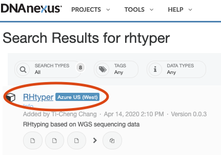
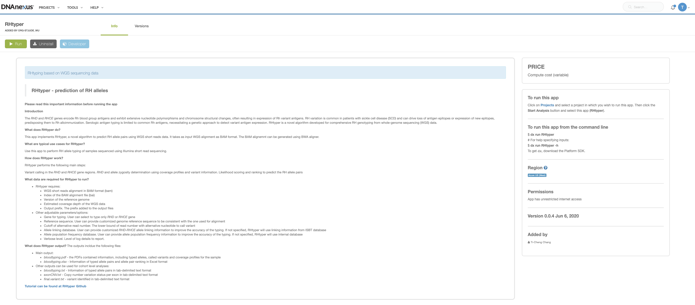
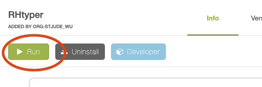
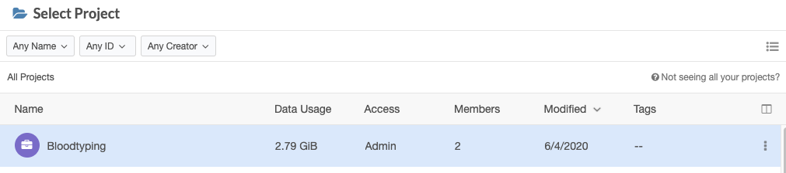
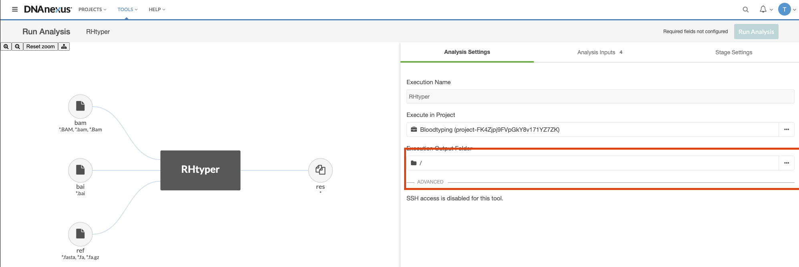
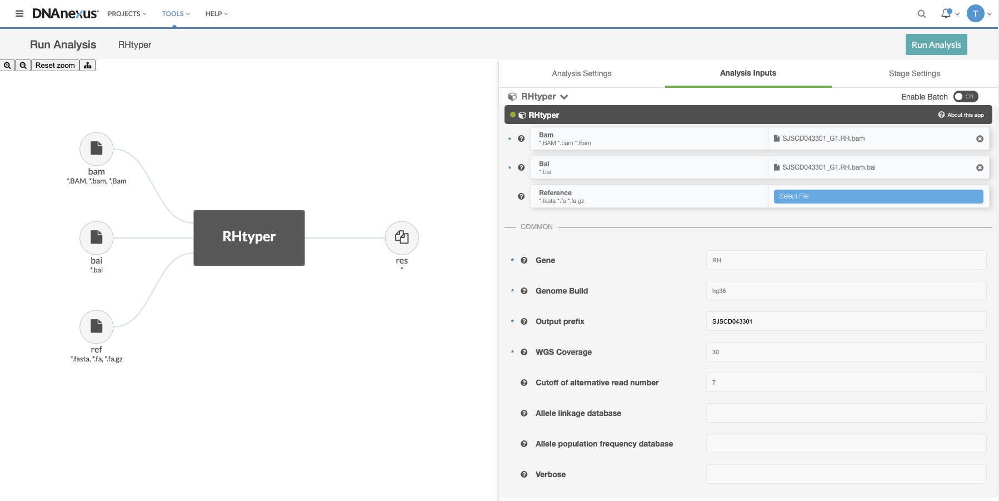
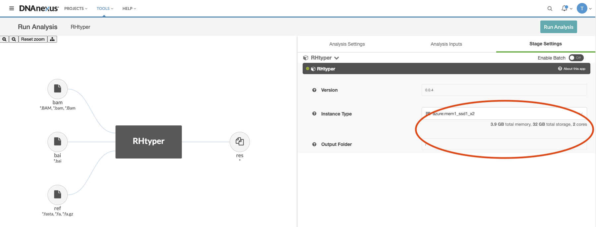
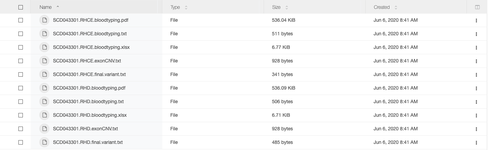

<!-- dx-header -->
# RHtyper 

Predict *RHD*/*RHCE* allele using Whole-Genome Sequencing data

<!-- /dx-header -->

<!-- Insert a description of your app here -->
> **RHtyper - prediction of RH alleles**

**Please read this important information before running the app**

## **Introduction**

The *RHD* and *RHCE* genes encode Rh blood group antigens and exhibit extensive nucleotide polymorphisms and chromosome structural changes, often resulting in expression of Rh variant antigens. RH variation is common in patients with sickle cell disease (SCD) and can drive loss of antigen epitopes or expression of new epitopes, predisposing them to Rh alloimmunization. Serologic antigen typing is limited to common Rh antigens, necessitating a genetic approach to detect variant antigen expression. RHtyper is a novel algorithm developed for comprehensive RH genotyping from whole-genome sequencing (WGS) data.

## **What does RHtyper do?**

This app implements RHtyper, a novel algorithm to predict RH allele pairs using WGS short reads data. It takes as input WGS alignment as BAM format. The BAM alignemnt can be generated using BWA aligner.

## **What are typical use cases for RHtyper?**

Use this app to perform RH allele typing of samples sequenced using Illumina short read sequencing.

## **How does RHtyper work?**

RHtyper performs the following main steps:

Variant calling in the *RHD* and *RHCE* gene regions.
RHD and allele zygosity determination using coverage profiles and variant information.
Likelihood scoring and ranking to predict the RH allele pairs

## **What data are required for RHtyper to run?**

1. RHtyper requires:
   * WGS short reads alignment in BAM format (bam)
   * Index of the BAM alignment file (bai)
   * Version of the reference genome
   * Estimated coverage depth of the WGS data
   * Output prefix. The prefix added to the output files
2. Other adjustable parameters/options:
   * Gene for typing. User can select to type only *RHD* or *RHCE* gene
   * Reference sequence. User can provide customized genome reference sequence to be consistent with the one used for alignment
   * Cutoff of alternative read number. The lower bound of read number with alternative nucleotide to call variant
   * Allele linking database. User can provide customized *RHD*-*RHCE* allele linking information to improve the accuracy of the typing. If not specified, RHtyper will use linking information from ISBT database
   * Allele population frequency database. User can provide allele population frequency information to improve the accuracy of the typing. If not specified, RHtyper will use internal database
   * Verbose level. Level of log details to report.

## **What data are the format for Allele linking database and Allele population frequency database?**

Both databases are in tab-delimited text format and can be created using Excel (with headers). Examples are shown below.

1. Allele linking database

| Gene | Allele name | Allele detail | Alias | Linked | comment |
| :---: | :---: | :---: | :---: | :---: | :---: |
| RHCE | RHCE\*01.02.01 RHCE\*ce.02.01 | RHCE\*ce48C,1025T | RHCE\*ceTI | RHD\*04.01_RHD\*DIVa ||
| RHCE | RHCE\*01.05.01 RHCE\*ce.05.01 | RHCE\*ce48C,712G,787G,800A | RHCE\*ceEK | RHD\*DAR ||
| RHD | RHD\*04.01 RHD\*DIVa | RHD\*186T,410T,455C,1048C | | RHCE\*01.02.01 RHCE\*ce.02.01 ||
| ... | ... | ... | ... | ... | ... |

2. Allele population frequency database

| Allele name	| Nucleotide | Allele detail | Alias | PopFreq |
| :---: | :---: | :---: | :---: | :---: |
| RHD\*10.00 RHD\*DAU0 | c.1136C>T | RHD\*1136T | RHD\*1136T | 0.1651 |
| RHD\*09.03.01 RHD\*DAR3.01 | c.602C>G; c.667T>G; c.819G>A |	RHD\*602G,667G | RHD\*602G,667G | 0.0298 |
| RHCE\*02 or RHCE\*Ce RHCE\*C RHCE\*e | c.48G>C | | RHCE\*Ce | 0.119 |
| ... | ... | ... | ... | ... |

## **What does RHtyper output?**

The outputs incldue the following files:

1. Main output:
   * *bloodtyping.pdf* - the PDFs contained information, including typed alleles, called variants and coverage profiles for the sample
   * *bloodtyping.xlsx* - Information of typed allele pairs and allele pair ranking in Excel format
2. Other outputs can be used for cohort level analyses:
   * *bloodtyping.txt* - Information of typed allele pairs in tab-delimited text format
   * *exonCNV.txt* - Copy number variation status per exon in tab-delimited text format
   * *final.variant.txt* - variant identified in tab-delimited text format

## **How to run RHtyper?**

1. Find RHtyper from the DNAnexus Tools library

2. Click RHtyper to access the app

3. Introduction interface of the RHtyper app. Deatils of the app and required/optional parameters can be seen here

4. Click Run icon to setup a run

5. Select a project space to run the app. Samples' alignment BAM file, BAM index file and other optional files are required to be accessible from the project.

6. Adjust settings in the "Analysis Settings" section

7. Provide required inputs (labeled with astrerisks) for the "Analysis Input" section

8. Adjust settings in the "Stage Settings" section. NOTE: the instance type can be changed to increase the memory for a run

9. Click "Run" to execute the analysis 

10. Output is saved in the folder specified at step8

