<!-- dx-header -->
# RHtyper 

Predicts *RHD*/*RHCE* genotypes using whole-genome sequencing (WGS) data

<!-- /dx-header -->

<!-- Insert a description of your app here -->
> **RHtyper - prediction of RH alleles**

**Please read this important information before running the app**

## **Introduction**

The *RHD* and *RHCE* genes encode Rh blood group antigens and exhibit extensive nucleotide polymorphisms and chromosome structural changes, often resulting in expression of Rh variant antigens. *RH* variants are common in people of African descent including patients of sickle cell disease and can drive loss of antigen epitopes or expression of new antigen epitopes, predisposing these patients to Rh alloimmunization. Serologic antigen typing is limited to common Rh antigens, necessitating a genetic approach to detect variant antigen expression. RHtyper is a novel algorithm developed for comprehensive *RH* genotyping from WGS data.

## **What does RHtyper do?**

RHtyper predicts *RHD* and *RHCE* genotypes by using short-read WGS data, specifically WGS alignment files in BAM (\*.bam) format generated by short read aligners.

## **How does RHtyper work?**

RHtyper predicts RHD and RHCE genotypes through the following main steps:

1. Variant calling;
2. Determining RHD gene zygosity and allele zygosity by coverage profiles and variant information; and 
3. Likelihood scoring and ranking to predict the most fit RH allele pairs.

## **What data parameters does RHtyper require?**

1. Required data and data parameters: 
   * Short-read WGS alignment files (.bam)
   * Index of the BAM alignment files (.bai)
   * Version of human reference genome
   * Output prefix (added to output files)
   * Estimated coverage depth of the WGS data
2. Optional data and adjustable data parameters:
   * Customized reference genome sequence; users can provide a customized reference genome sequence that is used for generating the alignment files
   * Customized allele linkage database; users can provide customized RH allele linkage information specific to the study population (If not specified, RHtyper uses haplotype association information from the International Society of Blood Transfusion (ISBT) database)
   * Customized allele population frequency database; users can provide a customized allele population frequency database specific to the study population (If not specified, RHtyper uses a default database that is updated continually) 
   * Gene(s) for genotyping; users can select RHD and RHCE, RHD only, or RHCE only
   * Cutoff of alternative nucleotide read number for variant calling 

## **What data format is required for the allele linkage and allele population frequency databases?**

Both databases are in tab-delimited text format and can be created using Excel (with headers). Examples are shown below.

1. Allele linkage database:

| Gene | Allele name | Allele detail | Alias | Linked | comment |
| :---: | :---: | :---: | :---: | :---: | :---: |
| *RHCE* | *RHCE\*01.02.01 RHCE\*ce.02.01* | RHCE\*ce48C,1025T | *RHCE\*ceTI* | *RHD\*04.01_RHD\*DIVa* ||
| *RHCE* | *RHCE\*01.05.01 RHCE\*ce.05.01* | RHCE\*ce48C,712G,787G,800A | *RHCE\*ceEK* | *RHD\*DAR* ||
| *RHD* | *RHD\*04.01 RHD\*DIVa* | RHD\*186T,410T,455C,1048C | | *RHCE\*01.02.01 RHCE\*ce.02.01* ||
| ... | ... | ... | ... | ... | ... |

2. Allele population frequency database:

| Allele name	| Nucleotide | Allele detail | Alias | PopFreq |
| :---: | :---: | :---: | :---: | :---: |
| *RHD\*10.00 RHD\*DAU0* | c.1136C>T | RHD\*1136T | *RHD\*1136T* | 0.1651 |
| *RHD\*09.03.01 RHD\*DAR3.01* | c.602C>G; c.667T>G; c.819G>A |	RHD\*602G,667G | *RHD\*602G,667G* | 0.0298 |
| *RHCE\*02 or RHCE\*Ce RHCE\*C RHCE\*e* | c.48G>C | | *RHCE\*Ce* | 0.119 |
| ... | ... | ... | ... | ... |

## **What RHtyper outputs are included?**
1. Main output:
   * *bloodtyping.pdf* - Predicted alleles, variants, and coverage profiles in a PDF file 
   * *bloodtyping.xlsx* - Information of typed allele pairs and ranking of allele pairs in an Excel worksheet 
2. Other text outputs that can be used for aggregated analyses:
   * *bloodtyping.txt* - Predicted genotypes in a cohort of samples in a tab-delimited text format
   * *exonCNV.txt* - Copy number variation status per exon in a tab-delimited text format
   * *final.variant.txt* - Variant identified in a tab-delimited text format

## **How to run RHtyper?**
**NOTE**: the latest DNAnexus web interface is used for the following workflow

1. Create a new project. If you have an existing project, please skip to step 5.

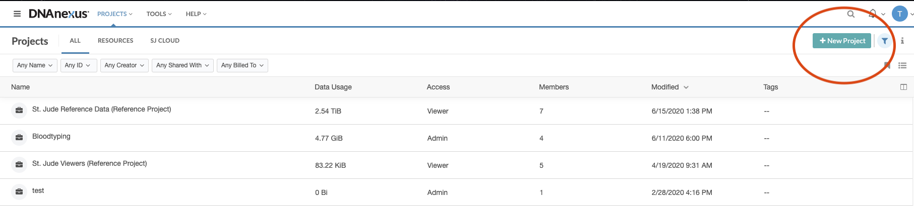

2. Name the New Project and click Create Project

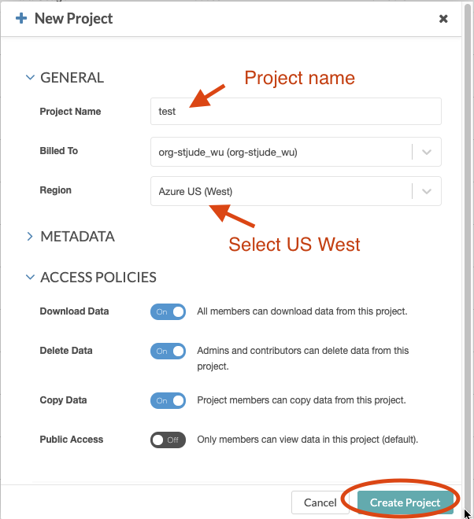

3. Upload BAM and BAI files: Under MANAGE, click Add, and select Upload Data

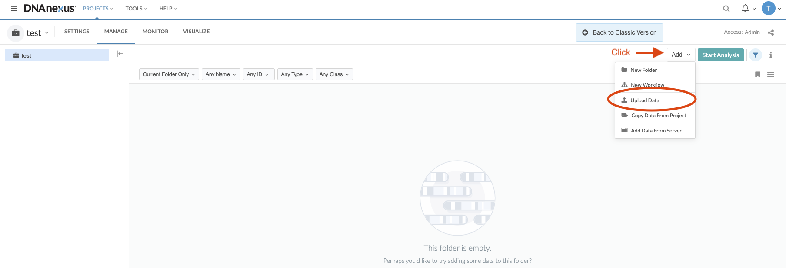

4. Upload BAM and BAI files following the instructions on the screen 

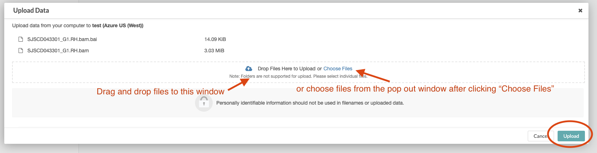

5. Find RHtyper: Click the search icon and type “RHtyper”

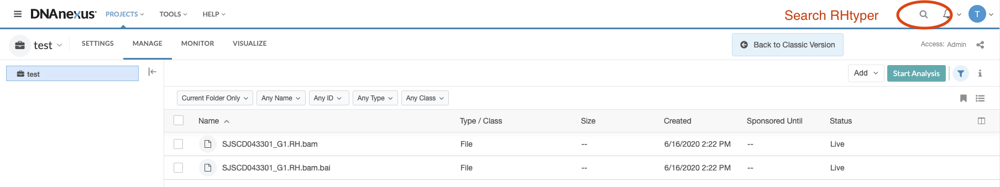

6. Select RHtyper

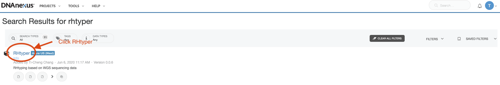

7. Install RHtyper for the first-time user. **Note**: introduction and parameter settings of RHtyepr can be found on this page

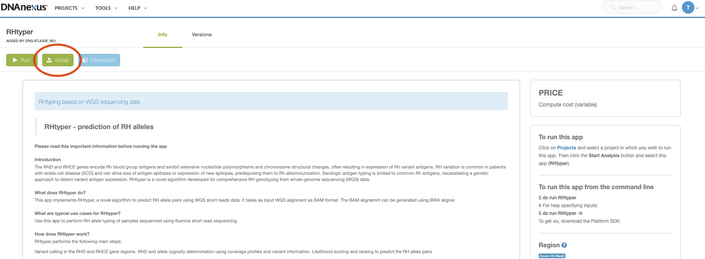

8. Click "Run" button to set up a new analysis

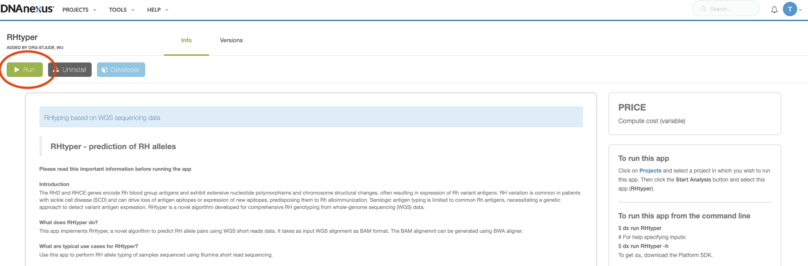

9. Select the project created at step1 or other projects containing the alignment BAM files for analyses.

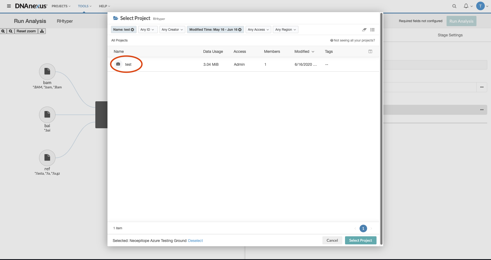

10. Select a folder for output results: Under Analysis Settings, click Execution Output Folder

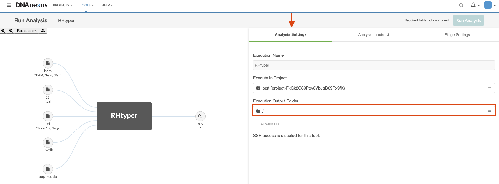

11. Create an output folder: Create a New Folder or select an exiting folder, then click Select Folder

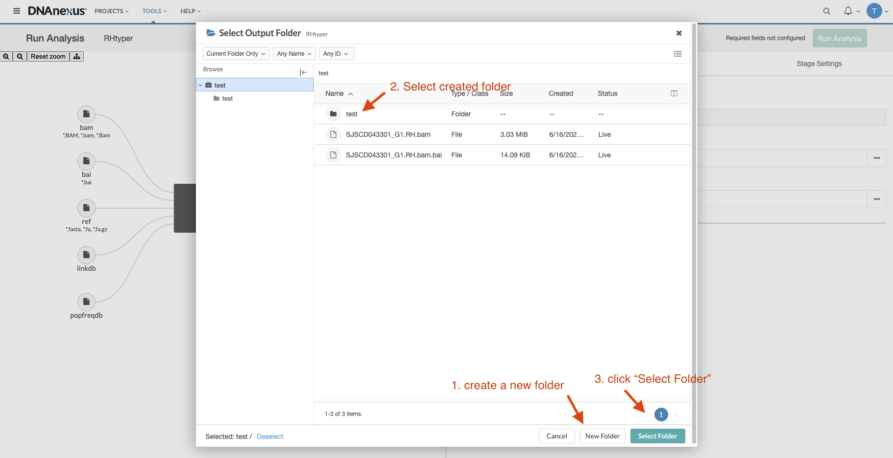

12. Provide input data information: Under Analysis Inputs, select BAM and BAI files and fill the required information (\*) about your input data. 

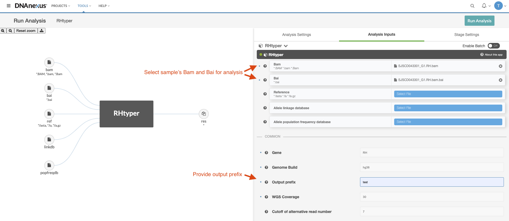

13. Adjust output settings under "Stage Settings" section. Click "Run Analysis" button to start the RHtyping. **NOTE**: the instance type can be adjusted to increase memory for a run

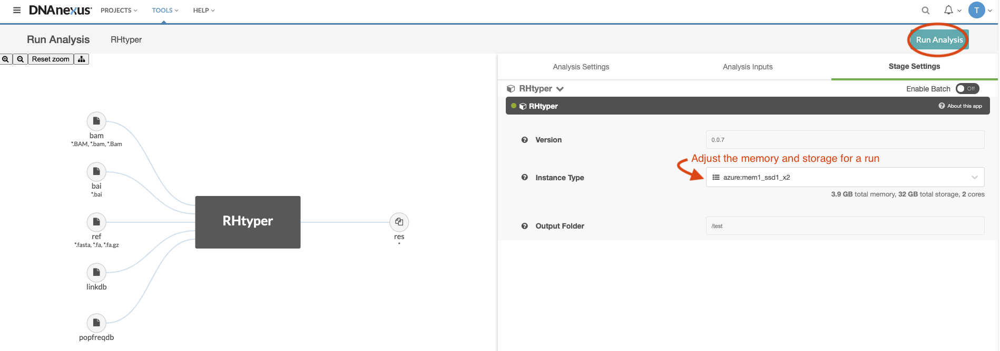

14. Output is saved in the folder specified at step10

